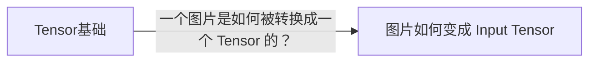

# Knowledge lineage views

This reference owns learner-facing views derived from LearningRecord knowledge-lineage metadata. It does not own or create canonical relation facts; those live only in each child LearningRecord under the shared LearningRecord contract.

Use this reference when the user explicitly asks to see/reconcile knowledge growth, or when `integrate` needs to reflect an integrated Record in the Learning Map or lineage view.

## Source of truth

Read only the current topic workspace. Use:

- the confirmed `learning-map.md` for formal learning-decision nodes;
- LearningRecords in the workspace `records/` directory and their supported `relations` metadata;
- the integration target/node already established by the active synthesis operation.

Do not scan unrelated projects, external knowledge stores, or chat history to invent relations. Do not infer `derived-from` from semantic similarity. Ignore unsupported relation types rather than guessing their meaning.

## Learning Map Record attachments

The Learning Map remains a learning-decision/question-lineage view. Formal nodes are still only user-confirmed learning questions.

When an integrated LearningRecord is associated with an existing formal Map node, the node may show exactly one lightweight reader-facing attachment for that Record:

```markdown
- [x] 模型输入为什么需要预处理？
  - ↳ 📄 [图片如何变成 Input Tensor](records/图片如何变成Input Tensor.md)
```

The attachment:

- is not a formal Map node;
- has no `[ ]`, `[~]`, `[x]`, or `[-]` lifecycle marker of its own;
- does not create or imply completion provenance;
- does not change the Map parent/child question structure;
- is idempotent: one node/Record pair appears at most once;
- may be updated if the Record title/path changes, but must not be duplicated.

If a Record is integrated only as supplemental knowledge with no accepted Map-node association, do not invent a Map attachment target merely to display it.

## `knowledge-lineage.md`

Use the stable workspace-root path `knowledge-lineage.md` for the derived knowledge-growth view. Create it only when at least one supported `derived-from` edge exists in the topic workspace or when the user explicitly asks to see the knowledge-lineage view and such edges can be rendered. If no supported edges exist, report that there is not yet a durable lineage graph rather than manufacturing one.

The file is fully regenerable from Record metadata. Never treat edits to this view as canonical relation changes; relation corrections belong in the child LearningRecord first.

Render a concise title and a left-to-right Mermaid graph by default:

```markdown
# 知识生长脉络



## 记录索引

- [Tensor基础](records/Tensor基础.md)
- [图片如何变成 Input Tensor](records/图片如何变成Input Tensor.md)
```

Use simple local graph ids such as `R1`, `R2`; they are rendering details, not persistent identifiers. Node labels come from Record titles. Edge labels come from the canonical relation `question`. The record index gives clickable Markdown navigation to every Record appearing in the graph.

When multiple Records form a chain, render all supported edges in one graph. A Record may appear once even when referenced by multiple edges. Do not invent hierarchy beyond the explicit edges.

## Reconciliation

On reconciliation:

1. read the current Records and supported `derived-from` edges;
2. regenerate the graph and record index from those canonical facts;
3. update `knowledge-lineage.md` only when the derived output changed;
4. reconcile only Map attachments relevant to the active integration or explicitly requested view work;
5. do not mutate LearningRecord relation metadata, Ticket lifecycle, Map completion provenance, or mother-document content as a side effect of rendering.

Done when every rendered edge can be traced to exactly one canonical child-Record `derived-from` relation, every Map attachment points to an already-associated Record without becoming a formal node, and no duplicate relation source has been created.
