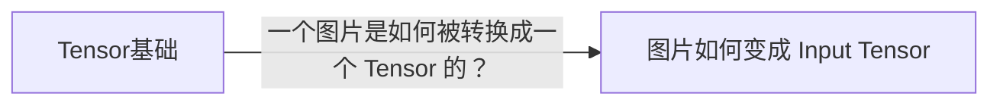

# Knowledge lineage views

This reference renders learner-facing views from canonical LearningRecord lineage. Canonical `derived-from` facts live on child Records under the shared [LearningRecord contract](../../_shared/learning-record.md).

Use it for an explicit lineage-view request or when `integrate` needs to refresh a Record attachment/derived graph. Read only the current topic Map, its `records/`, and the Map association already established by the active synthesis operation.

## Map Record attachments

The Learning Map remains a learning-decision/question-lineage view. An already-associated Record may appear once under its formal node as lightweight navigation:

```markdown
- [x] 模型输入为什么需要预处理？
  - ↳ 📄 [图片如何变成 Input Tensor](records/图片如何变成Input Tensor.md)
```

An attachment is a view element: no lifecycle marker, no completion provenance, and no change to Map question hierarchy. Update its title/path when needed and keep each node/Record pair unique. Supplemental knowledge without an accepted node association has no Map attachment target.

## `knowledge-lineage.md`

Use the stable workspace-root `knowledge-lineage.md` when at least one supported `derived-from` edge can be rendered. It is fully regenerable from Record metadata.

Default rendering is a concise left-to-right Mermaid graph plus clickable Record index:

````markdown
# 知识生长脉络



## 记录索引

- [Tensor基础](records/Tensor基础.md)
- [图片如何变成 Input Tensor](records/图片如何变成Input Tensor.md)
````

Graph ids are local rendering details. Node labels come from Record titles; edge labels come from canonical relation `question`. Render every supported edge in the current topic once and every participating Record once. Unsupported relation types are ignored until their contract exists.

If no supported edge exists, report that no durable lineage graph exists yet rather than creating inferred relationships.

## Reconcile

1. Read current child-Record `derived-from` edges.
2. Regenerate graph + Record index from those facts.
3. Write the derived file only when output changed.
4. Reconcile only Map attachments relevant to the active integration or explicit view request.

Rendering changes views only; relation metadata, Ticket lifecycle, Map completion provenance, and mother-document content remain with their owners.

Done when every rendered edge traces to one canonical child-Record relation, every attachment points to an already-associated Record, and rerunning the view produces no duplicate facts.